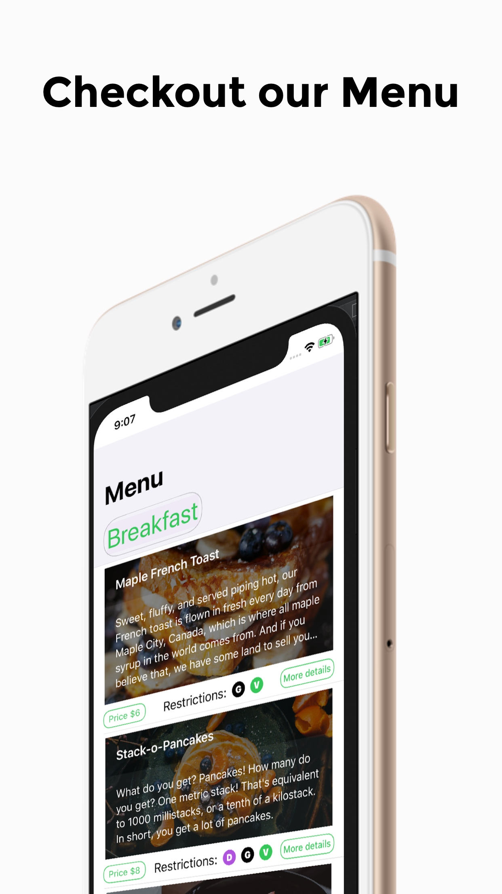
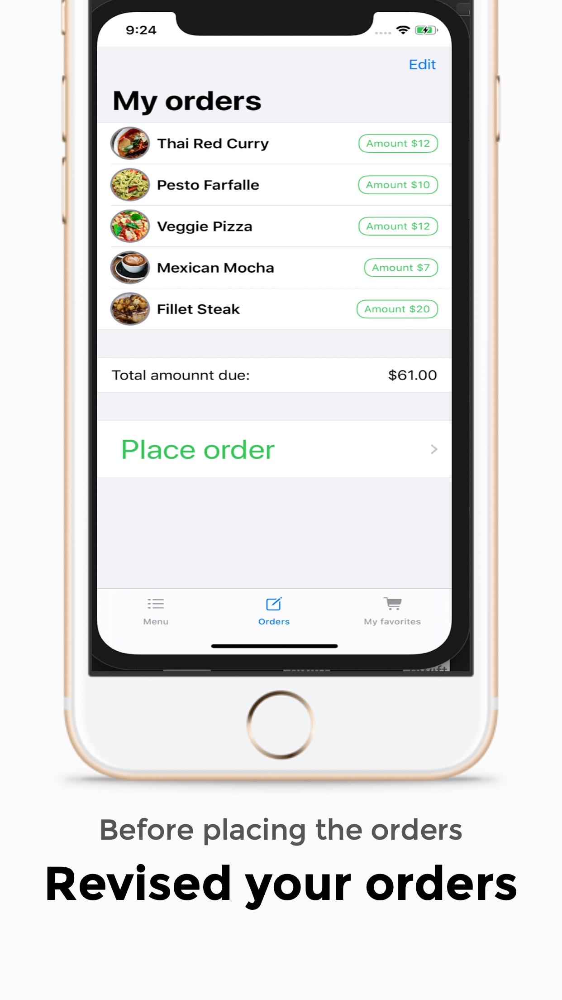
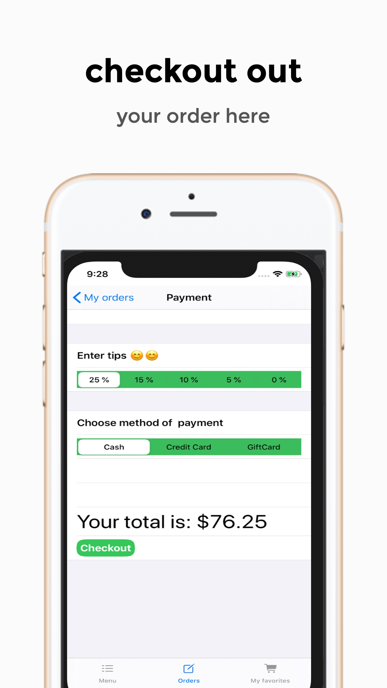

# Kula_chapchap
__Kulachapchap__: is just but a dummy app that tries to imitate functionalitie of an ordering app. It is pretty simple and easy to follow. Through this simple app, I was able practice app design skills as well as learned newly releasede Apple framework; swiftUI
__These are some swiftUI fundamental learned:__
* **Layout Design**
  * __Create List (TableView)__
    * _VStack (vertical stackview)_
    * _Hstack(Horizontal stackview)_
    * _Zstack (overlaying View)_
    * _TabView(TabBarView)_
* __This simple app has basic functionality like any other ordering app__
  * **Navigation View and NavigationLink**
_to navigation from view to view
  * __ability to select items to buy and checkout__
  * __payment functionality__: 
     * adding tips for great serving
     * choose on what method to clear the bills
  
* __wishlisting items functionality__: 
     * Add items to a wishlist
     * Remove items from a wishlist 
     

